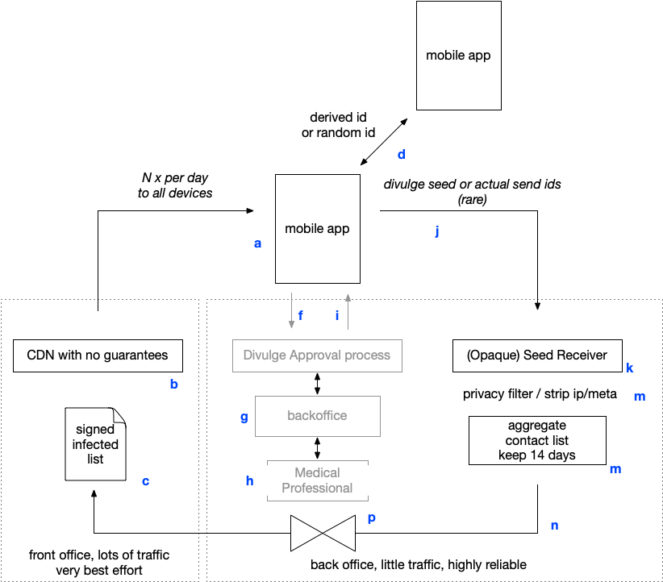

# DP3T Backend Specification

This proposal is based on the D3PT API specification found [here](https://github.com/DP-3T/dp3t-sdk-backend/blob/develop/documentation/documentation.pdf).

The aim of this proposal is twofold: firstly to improve the existing specification by including more details, such as extra HTTP headers. This helps to ensure compatibility between implementations. Secondly, we wish to extend the API to allow for a more efficient distribution of the Cuckoo Filter binary data. These filters will be downloaded by potentially hundreds of millions of users daily so there is a real benefit to doing so efficiently.

<Ryan: move this to a different proposal? it's orthogonal to data distribution although it will be required >

Thirdly and finally, we wish to add an mechanism to the API which supports the dynamic discovery of DP3T endpoints for different jurisdictions or countries. This enables the implementations to support infection checking across borders - something which is required in places such as continental Europe. Especially around borders :)

## Operational setting

Logical/abstract architecture - to help discuss the non-functional, information security and compliance aspects of any implementation. And help guide what needs to be arranged in terms of gouvernance.

## Overview

There are three systems/backends in play. 

* A CDN like bulk publishing system (b, c) that pushes out the infection lists to all mobiles participating, every day.
* A system that collects the data from just the (infected) mobiles, just once per infection
* [optionally] An approval/filtering process that ensures that only validated infections make it into the official list for those countries that require, say, a test or a professional assesment.

A Mobile app(a) installed on million of devices does regular (e.g. 1-4 times per day) fetches through a common Content Delivery Network (CDN), with no particular integrity or reliability guarantees (best effort)[^1].

Fetched is a (possibly digitally signed file (c)) with the contamination details of the day. This file is generated by a very reliable central backend (m) and contains just the relevant information (p).

At some point (e.g. on a national scale, several 10's to 100's of time an hour) a medical professional will ask if his patient is willing to divulge his contact (process f,mg,h,i) or something or someone deceides that an infection needs to be reported.

The device then posts, j, plain http(s)/REST, its opaque contact data to the receiver(k). Depending on the protocol - this is either a seed or the actually broadcasted IDs (d).
 
This is filtered, at pure IP level, by (k); where no data is kept but a short log and a few percent of the net-flows.

The list of the last 14 days is then filtered, if appropriate, before it is deliveryed every few hours or every day to the distribution area.

## Ramfications for the API

This means there are three areas with very different properties. 

* CDN: bulk, only handles public data, best effort, needs to be hit by the whole population. very few privacy concerns beyond the usual ones of seeing IP's and headers. Should respond fast/efficient. No state, no need for logging or backups.
* Receiver: little traffic, but should `never loose' data and much more privacy sensitive - as there is an implied; this person may be infected. Batch oriented; so no speed or other concerns; very clear data retention expectations
* Is Infected Approval process (optional): process that supports medical processes - and may be highly sensitive - but largely based on existing processes, medical records, Laboratory Information Systems and so on; and inteface is just an 'ok' to publish.

This allows for API optimisation.

## Overview for app developers
=======
## Big picture overview for app developers who haven't read anything else

<Ryan: I want the document to be self-contained, that makes it easier to onboard developers or at least parse the rest>

See https://github.com/DP-3T/documents/blob/master/DP3T-Slideshow.pdf

#### Design 1 DP3T and TCN:

	for each (cuckoo-filter in cuckoo-filters)
		take the seed; reconstruct the N broadcasted ID
			for each id reconstructed
				check them in the list of local ids received.
					stop if you are in it.

##### Design 2:

	for each (cuckoo-filter in cuckoo-filters)
		load data from `uri_filter` into your cuckoo-filter
			check each of your local ids for precence in the cuckoo-filter.
					stop if you are in it.

Optionally - if Design 2 is to carry metadata (like TCN and PACT) or if the filter is very small/'too' efficent

	for each (cuckoo-filter in cuckoo-filters)
		load data from `uri_filter` into your cuckoo-filter
			check each of your local ids for precence in the cuckoo-filter.
			if ( interaction in cuckoo-filter )
				download a partial list of ids from uri_data	
					stop if you are in it.

#### PACT and TCN:

	for each (cuckoo-filter in cuckoo-filters)
		check them in the list of local ids received.
			stop if you are in it.

# Endpoints -- CDN / bulk distribition

To check for infection: first load the list of cuckoo-filters from /exposed.

	for each (cuckoo-filter in cuckoo-filters)

		load data from `uri_filter` into your cuckoo-filter
		run your local interaction EphIDs through the cuckoo-filter.

		if ( any EphID are found in the cuckoo-filter )
			false positives are possible, so download the big list of ids from uri_data and check them
		else
			stop because you're not exposed

## Existing Endpoints

Please refer to the D3PT API specifications for details on the parameters and message content. 

Below end points are all for the CDN / bulk distribution.

Non functional expectations are

* Handle at least one fetch/day from the mobiles (millions of request per day, thousands per second).
* Very resistant to repeated/superfluent fetches
* Bad behaviour of one should not jeopardize _delivery_ to others.
* Little or no security
* Tamperproofing is desirable - but for most protocols not uber critical as the match-space is very large and thus resistant against false positives. The tampering is a risk for not reporting infected people that they are infected (which is in fact what some device owners may well desire, e.g. to keep their jobs).

#### general option/concern

Sign all responses with a RFC 3161 timestamp/signature

### POST /v1/exposed

<Ryan: I have nothing to add here>

Dirkx: given

	application/json

	{
		[{
			time_stamp_from: 'isodatetime',
			time_stamp_to: 'isodatetime',
			hash: 'hash_which_identifies_this_for_changes'
			uri_filter: '/whatever/the/uri/is/for/the/coocoofilter'
			uri_data: '/whatever/the/uri/is/for/the/big/binary'
			exposed_key_bits: 8 /* ZZZZ number of bits to use for 'exposed/<key>/extra-data fetches
		}, ...]

	}

	Returns an json array containing a list of data batches in reverse-chronological order - so the latest update comes first. The timespan of the file is included along with a relative url to the coco filter binary and to the data file binary. The hash identifies the uri_data and thus changes if the data changes (so mistakes can be fixed).

Q: Why do we need the hash ? It is too late by the time you see it ? And you can do a hash on the payload, eTag/get-if-modified more important ?

### GET /v1/exposed/dayDateStr

#### Content-Type

	Content-Type: application/json; charset=UTF-8

#### Accept-Ranges
	
	Accept-Ranges: bytes

Allows requests for partial ranges, allowing for resume-support.

#### ETag

	ETag: "hash"

The hash identifies the binary data and it used for change-checking. By including a strong ETag we allow for the CDN/cache to work efficiently and support partial downloads.

The hash itself is the same sha-256 as described in the specifications.

Dirkx: what worries me is that we hard code 'fetch by day'. Whereas in fact we generaly want to have the last 'X time' going back. So everything 'since' a day. Either by specifying that or by fetching the most recent one; and dynamically working backwards until we are at the right point.

Q: How about a 

	GET /{version}/exposed/<n>
	
With <n> being 0 for the first fetch; and if the time_stamp_to is too low; you fetch 1, then 2, then 3 until the app decides it has enough ? So we can optimise this if we have waves of infections ? And can optimise purely backend ?

## New Endpoints (for supporting multiple non-overlapping data dumps)

{batch-id} is a date/time in the form yyyymmddhhmm

### GET /v1/exposed [multiple batches, no overlap version]

Returns an json array containing a list of data batches in reverse-chronological order - so the latest update comes first. The timespan of the file is included along with a relative url to the coco filter binary and to the data file binary. The hash identifies the uri_data and thus changes if the data changes (so mistakes can be fixed).

These batches don't overlap, so they must all be downloaded.

<Ryan: I assume that the max length of this list is 14 days * 24 dumps * 200 bytes = 67200 bytes, 6720 bytes after gzip so small. >
<Ryan: You could also publish multiple batches: last 1-day, last 3-days, last-14 days and publish them on well known urls. >

Dirkx: there is value in having the N-days a bit more flexible. So you can temper downloads/gradually feed, say, a neighbouring country, in.

#### Content-Type

	Content-Type: application/json; charset=UTF-8

#### ETag

	ETag: "hash"

<Ryan: can be any kind of hash, whats the most widely used default option? :) >

#### Message content

	{
		[{
			time_stamp_from: '2020-04-20T19:30:16Z',
			time_stamp_to: '2020-04-20T21:30:16Z',
			data_uri: '/exposed/data/2020041634'
		}, ...]
	}

### GET /v1/exposed/data/{batch-id}

Returns the Cuckoo Filter 

#### Content-Type

	Content-Type: application/octet-stream

#### Accept-Ranges
	
	Accept-Ranges: bytes

#### ETag

	ETag: "hash"

### GET /v1/exposed/filter/latest

Returns the last file to be uploaded, it's otherwise identical to GET /v1/exposed/data/{batch-id}

#### X-Previous
	
	X-Previous: /v1/exposed/{batch-id}

This header includes a link to the previously uploaded file. This allows the application to load all of the filters without calling the index (it forms a linked-list).

Q: batchID - I think that want to use the N bits of the 'verify' key here from the Cuckoo filter ? Or alternatively in some config advertise how small that 'N' kan be (see field ZZZ above).

## New Endpoints (for supporting a 1-day, 3-d, n-day data file)

We provide the following endpoints which all have the same interface as `GET /v1/exposed/data/{batch-id}`.

	GET /v1/exposed/data/24h
	GET /v1/exposed/data/48h
	GET /v1/exposed/data/72h
	GET /v1/exposed/data/1w
	GET /v1/exposed/data/2w
	GET /v1/exposed/data/all

<Ryan: I would appreciate feedback on the data split and uris>

The advantage here is that the uris are fixed, the http clients / caches etc can use the ETag to handle updates and the clients only have to scan a single filter no matter how out-of-date their data is. This is expecially nice when clients need to scan for multiple countries (i.e. over multiple endpoints).

They can also regularly poll /v1/exposed/data/24h very cheaply because their http stack is only comparing the ETag hashes.

Q: Where 'batch-id' are the first N bits of the (hashed) key - with N from the cuckoo filter used.

^1: It will likely be a requirement that the CDN webservers have the Date: header set (RFC 2616, section 14.18) correctly -- as this stabilises the calcuation of 't'.

# OTHER STUFF

<Ryan: I'm using this section to dump ideas for now >

## /meta/configuration

Returns configuration for the risk algorithm:

see: end of page 11 of the WP https://github.com/DP-3T/documents/blob/master/DP3T%20White%20Paper.pdf

## /meta/authorities

Returns a list containing the infection authority per region/country. Where this api can be found so you can check your risks if you've been abroad.

	GET /meta/authorities

	application/json

	{
		"NL": "",
		"DE": "",
		...
	}

*Ryan: ideally this would be a published at a single well known source globally and not included in an api.*

# Messages

## CoCoFilterFormat

Define it.

## ExposedDeviceIdentifiersFormat

Define it.

